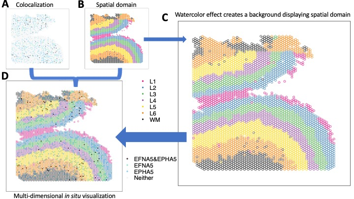

# escheR

<!-- badges: start -->
R Package Status: 
[](https://lifecycle.r-lib.org/articles/stages.html#experimental)
[](https://github.com/boyiguo1/escheR/actions)

Bioc Status: 
[](https://bioconductor.org/checkResults/release/bioc-LATEST/escheR)
[](https://bioconductor.org/checkResults/devel/bioc-LATEST/escheR)
[](https://bioconductor.org/packages/release/bioc/html/escheR.html#since)
[](http://bioconductor.org/checkResults/devel/bioc-LATEST/escheR/)

<!-- badges: end -->

The goal of `escheR` is to create an unified multi-dimensional spatial visualizations for spatially-resolved transcriptomics data following Gestalt principles. [Gestalt principles](http://www.scholarpedia.org/article/Gestalt_principles) refer to a set of rules describing how humans perceive and interpret visual information and are commonly applied in art and designs. Our implementation is based on the state-of-art data visualization framework [`ggplot2`](https://ggplot2.tidyverse.org/) to map individual variables to different aesthetics to simultaneously display disparate variables, showing their relationship in a spatial context.



Our preprint describing the innovative visualization is available from [bioRxiv](https://www.biorxiv.org/content/10.1101/2023.03.18.533302).

# Installation

You can install the latest release version of `escheR` from Bioconductor. with using the following code will install version of the `nnSVG` package from Bioconductor. Additional details are shown on the [Bioconductor](https://bioconductor.org/packages/escheR) page.

```{r}
if (!require("BiocManager", quietly = TRUE)) {
    install.packages("BiocManager")
}
BiocManager::install("escheR")
```

The latest development version can also be installed from the `devel` version of Bioconductor or from [GitHub](https://github.com/boyiguo1/escheR) following

```{r}
if (!require("devtools")) install.packages("devtools")
devtools::install_github("boyiguo1/escheR")
```

If you have R version before v4.3 and would like to install `escheR`, you can follow

```{r}
if (!require("devtools")) install.packages("devtools")
devtools::install_github("boyiguo1/escheR@pre-R4.3")
```

> WARNING: The purpose of having the branch `pre-R4.3` is to allow users to use `escheR` before the formal release of R 4.3 and during the early stage of R 4.3 release. This branch will not update with any further development passing [`escheR v0.99.6`](https://github.com/boyiguo1/escheR/blob/devel/NEWS.md). We recommend users to update their R versions up to date.

# Input data format

To use `escheR`, we assume the input data are provided as a [`SpatialExperiment`](https://bioconductor.org/packages/release/bioc/html/SpatialExperiment.html) Bioconductor object. For people whose data are stored as a [`Seurat`](https://satijalab.org/seurat/articles/spatial_vignette.html) object, we advise to convert to a `SpatialExperiment` object before applying the workflow below.  


# Tutorial
Please find an end-to-end tutorial at [https://boyiguo1.github.io/escheR/](https://boyiguo1.github.io/escheR/articles/SRT_eg.html)


# Citation

Our preprint describing `escheR` is available from bioRxiv:

* Guo B, Hicks SC (2023). “escheR: Unified multi-dimensional visualizations with Gestalt principles.” _bioRxiv_. doi:10.1101/2023.03.18.533302

# Acknowledgement

## The importance of visual analytics

The panel of relational plots is from the book _the visual display of quantitative information_ by [Edward Tufte](https://www.edwardtufte.com/tufte/books_vdqi). This book inspired me to think more about the meaning of visual analytics in the era of computational science, and motivates me to think about statistical graphics design and its meaning.


## Development tools

- Continuous code testing is possible thanks to [GitHub
  actions](https://www.tidyverse.org/blog/2020/04/usethis-1-6-0/)
  through *[biocthis](https://lcolladotor.github.io/biocthis/)*,
- The [documentation
  website](https://boyiguo1.github.io/escheR/) is
  automatically updated thanks to
  *[pkgdown](https://CRAN.R-project.org/package=pkgdown)*.
- The code is styled automatically thanks to
  *[styler](https://CRAN.R-project.org/package=styler)*.
- The documentation is formatted thanks to
  *[devtools](https://CRAN.R-project.org/package=devtools)* and
  *[roxygen2](https://CRAN.R-project.org/package=roxygen2)*.
