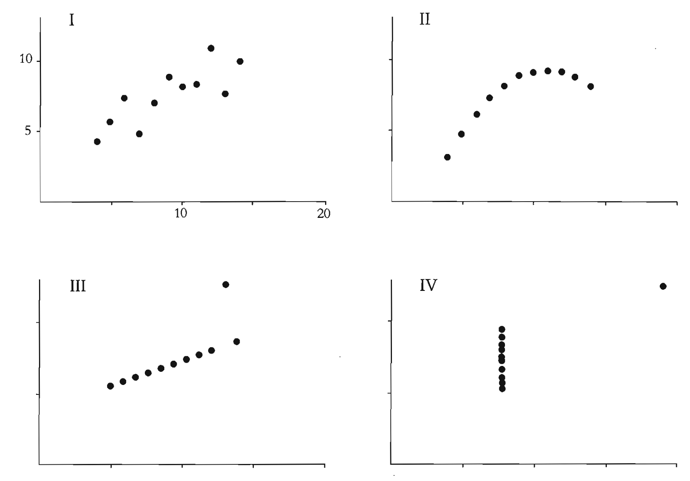

# escheR 

<!-- badges: start -->
R Package Status: 
[](https://lifecycle.r-lib.org/articles/stages.html#experimental)
[](https://github.com/boyiguo1/escheR/actions)

Bioc Status: 
[](https://bioconductor.org/checkResults/release/bioc-LATEST/escheR)
[](https://bioconductor.org/checkResults/devel/bioc-LATEST/escheR)
[](https://bioconductor.org/packages/release/bioc/html/escheR.html#since)
[](http://bioconductor.org/checkResults/devel/bioc-LATEST/escheR/)

<!-- badges: end -->

The goal of `escheR` is to create an unified multi-dimensional spatial visualizations for spatially-resolved transcriptomics data following Gestalt principles. [Gestalt principles](http://www.scholarpedia.org/article/Gestalt_principles) refer to a set of rules describing how humans perceive and interpret visual information and are commonly applied in art and designs. Our implementation is based on the state-of-art data visualization framework [`ggplot2`](https://ggplot2.tidyverse.org/) to map individual variables to different aesthetics to simultaneously display disparate variables, showing their relationship in a spatial context.


Our manuscript describing the innovative visualization is published in [_Bioinformatics Advances_](https://doi.org/10.1093/bioadv/vbad179).

# Installation

You can install the latest release version of `escheR` from Bioconductor. with using the following code will install version of the `nnSVG` package from Bioconductor. Additional details are shown on the [Bioconductor](https://bioconductor.org/packages/escheR) page.

```{r}
if (!require("BiocManager", quietly = TRUE)) {
    install.packages("BiocManager")
}
BiocManager::install("escheR")
```

The latest development version can also be installed from the `devel` version of Bioconductor or from [GitHub](https://github.com/boyiguo1/escheR) following

```{r}
if (!require("devtools")) install.packages("devtools")
devtools::install_github("boyiguo1/escheR")
```

If you have R version before v4.3 and would like to install `escheR`, you can follow

```{r}
if (!require("devtools")) install.packages("devtools")
devtools::install_github("boyiguo1/escheR@pre-R4.3")
```

> WARNING: The purpose of having the branch `pre-R4.3` is to allow users to use `escheR` before the formal release of R 4.3 and during the early stage of R 4.3 release. This branch will not update with any further development passing [`escheR v0.99.6`](https://github.com/boyiguo1/escheR/blob/devel/NEWS.md). We recommend users to update their R versions up to date.

# Tutorial
Please find an end-to-end tutorial at [https://boyiguo1.github.io/escheR/](https://boyiguo1.github.io/escheR/articles/SRT_eg.html)

## Syntax


# Frequently Asked Questions

* Can I use `escheR` on `SingleCellExperiment` object?

  Yes. Starting from Version 1.2.0, `escheR` supports the visualization of 
  dimensionality reduced embeddings of a `SingleCellExperiment` object by
  providing values to the argument `dimred`. For more information, please see
  [Beyond Sequence-based Spatially-Resolved Data](https://boyi-guo.com/escheR/articles/more_than_visium.html#visualized-dimensionality-reduced-embedding-with-singlecellexperiment).

* How can I make plots to visualize dimensional reduced embeddings?

  Yes, you can provide a string value to the`dimred` argument. The string value
  should be included in `reducedDimNames(object)`. For more information, please
  see [Beyond Sequence-based Spatially-Resolved Data](https://boyi-guo.com/escheR/articles/more_than_visium.html#visualized-dimensionality-reduced-embedding-with-singlecellexperiment).

* Can I highlight only a subset of groups/levels for a categorical variables?

  Yes, please find the example in [Adjusting aesthetics](https://boyi-guo.com/escheR/articles/SRT_eg.html#adjusting-aesthetics).

* Can `escheR` be directly applied to `Seurat` or `Giotto` objects?

  Unfortunately, `Seurat` or `Giotto` objects can not be directly pipe into
  `make_escheR` function. Instead, we provide a generic function that works
  with a `data.frame` object as input. Please find example via [Beyond Bioconductor Eco-system](https://boyi-guo.com/escheR/articles/more_than_visium.html#beyond-bioconductor-eco-system).

* How can I make a paneled figure containing multiple `escheR` plots?

  You can compile and arrange individual plots by `escheR` via functions, e.g. [`cowplot::plot_grid`](https://wilkelab.org/cowplot/articles/plot_grid.html), [`patchwork`](https://patchwork.data-imaginist.com/index.html). Please find the
  example via [Plot Multiple Samples](https://boyi-guo.com/escheR/articles/SRT_eg.html#plot-multiple-samples).

* How can I choose color palettes for `add_fill` and `add_ground` to minimize interference?

  Interested user can explore the topic on bivariate color palette. The [blog post](https://jakubnowosad.com/posts/2020-08-25-cbc-bp2/) by Jakub Nowosad and R package [`biscale`](https://cran.r-project.org/web/packages/biscale/vignettes/bivariate_palettes.html) could be helpful.

* Can I apply `escheR` to plot image-based spatially resolved data?

  In principle, `escheR` can be used to visualize image-based spatially-resolved (SR)
  data. See examples via [Image-based SpatialExperiment Object](https://boyi-guo.com/escheR/articles/more_than_visium.html#image-based-spatialexperiment-object).
  
  Nevertheless, we are still optimizing the design principles for image-based SR
  data due to the difference in throughput compared to the sequence-based
  spatially resolved data. Optimization for image-based SR data visualization
  will be the main focus of our upcoming updates. We are open to working with
  new ideas and seek collaboration.

* Can I plot polygons as each data points to show cell morphology?

  Unfortunately, not now. We acknowledge it would be a very important feature to
  consider, and we are motivated to implement it in our future updates.

# Citation

Our manuscript describing `escheR` is available via _Bioinformatics Advances_:

* Guo B, Huuki-Myers LA, Grant-Peters M, Collado-Torres L, Hicks SC (2023). “escheR: Unified multi-dimensional visualizations with Gestalt principles.” Volume 3, Issue 1, 2023, vbad179, https://doi.org/10.1093/bioadv/vbad179


# Acknowledgement

## The importance of visual analytics

The panel of relational plots is from the book _the visual display of quantitative information_ by [Edward Tufte](https://www.edwardtufte.com/tufte/books_vdqi). This book inspired me to think more about the meaning of visual analytics in the era of computational science, and motivates me to think about statistical graphics design and its meaning.


## Development tools

- Continuous code testing is possible thanks to [GitHub
  actions](https://www.tidyverse.org/blog/2020/04/usethis-1-6-0/)
  through *[biocthis](https://lcolladotor.github.io/biocthis/)*,
- The [documentation
  website](https://boyiguo1.github.io/escheR/) is
  automatically updated thanks to
  *[pkgdown](https://CRAN.R-project.org/package=pkgdown)*.
- The code is styled automatically thanks to
  *[styler](https://CRAN.R-project.org/package=styler)*.
- The documentation is formatted thanks to
  *[devtools](https://CRAN.R-project.org/package=devtools)* and
  *[roxygen2](https://CRAN.R-project.org/package=roxygen2)*.
